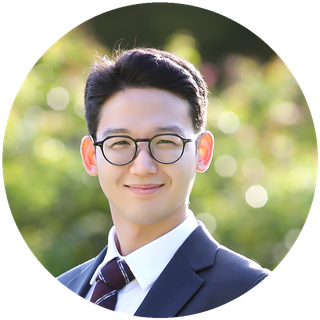

  

<h1 align="center">Gyuyeon Kim</h1>

  Ph.D. student, School of Computing, KAIST 
  Mobile and sensing systems / Physics-based AI

  Email: gyuyeonkim [at] kaist [dot] ac [dot] kr /
  <a href="https://linkedin.com/in/gyuyeon-kim">LinkedIn</a> /
  <a href="files/Gyuyeon_Kim_CV.pdf">CV</a>

My research focuses on developing novel applications in mobile and sensing systems by leveraging physics-based artificial intelligence to enable new forms of perception and inference that were previously unattainable.

## Publications

- **AcousTag: Batteryless 3D-Printed Acoustic Tag for Smart Speaker-based Event Monitoring**  
  **Gyuyeon Kim**, Sehoon Lim, Jaewoo Son, Soundarya Ramesh, and Jun Han. IMWUT'26.

- **AutoScale: Vision-Based Overweight Truck Detection Utilizing A Following Autonomous Vehicle**  
  **Gyuyeon Kim**, Jaewoo Son, Sungmin Park, and Jun Han. IROS'26.

- **Testing Masks and Air Filters with Your Smartphones**  
  Bangjie Sun, Kanav Sabharwal, **Gyuyeon Kim**, Mun Choon Chan, and Jun Han. SenSys'23.

- **RampScope: Ramp-Level Localization of Shared Mobility Devices Using Sidewalk Ramps**  
  **Gyuyeon Kim***, Jonghyuk Yun*, Soundarya Ramesh, and Jun Han. HotMobile'23.  
  * Equal contribution.

## Posters

- **Towards Acoustic-Based Tagless Object Tracking with Smartwatches**  
  **Gyuyeon Kim**, Hyunwoo Kim, and Jun Han. MobiSys'24.

- **RampScope: Ramp-Level Localization of Shared Mobility Devices Using Sidewalk Ramps**  
  **Gyuyeon Kim***, Jonghyuk Yun*, Soundarya Ramesh, and Jun Han. HotMobile'23.  
  * Equal contribution.

## Education

- **Ph.D., School of Computing**, KAIST, 2025 - present  
  Korea Advanced Institute of Science and Technology (KAIST). Advisor: Jun Han

- **M.S., Electrical and Electronic Engineering**, Yonsei University, 2023 - 2025  
  Advisor: Jun Han

- **B.S., Electrical and Electronic Engineering**, Yonsei University, 2017 - 2023  

## Selected Honors

- Best Poster Award, ACM HotMobile 2023
- Presidential Science Scholarship, KOSAF, 2017 - 2023
